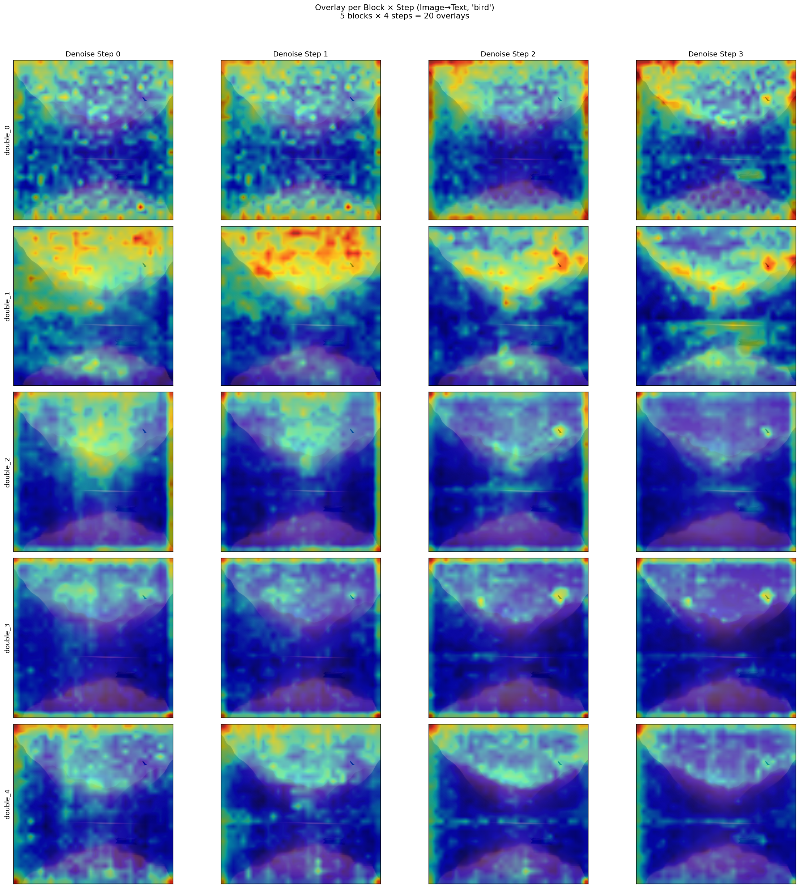

# Assginment-1 Part-3
## Task

- Generate an image with prompt : A serene mountain landscape at sunset with a lake reflecting the orange sky, a bird flying to the right, a small wooden boat floating on the lake. 

- Generate an attention map for the text "bird" .

## Which tool
- Claude code (cli tool) with Minimax-2.7
- Claude Code is the most popular tool for vibe coding. But for some reason I can't use their own models like opus... Minimax is an inexpensive choice (29 yuan per month).

## Prompting strategy
- Describe the demands elaborately. For some possible mistakes, claim them. 

## Performance
- Good: codes are correct without syntax errors since it checks it every time. Most of the time it can understand me.

- Bad: (sometimes) the "real requirements" of me.

## How many iterations
- Image Gen: 2

- Attention Map: over 10 (that's why you can see a lot of heatmaps in this repo)

## Errors
- I order it to generate attention map of "bird". I think this order means "which image token sees the text token *bird* most". However, since there is a cross-attention mechanism, it generate "how the text token *bird* see each pixel token. So the heatmaps are confusing. 
- And there are many reasons making it difficult to get an ideal heatmap in which the intension of the "bird" is the strongest. So I tried many times.

## Summary

The last try is: for each block × step: normalize each of 24 heads to 0-1, then average all 24 heads → one heatmap per block per step. In , row 2 to row 4, you can see a bright region of bird in some heatmaps.